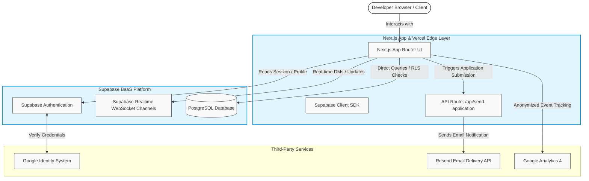
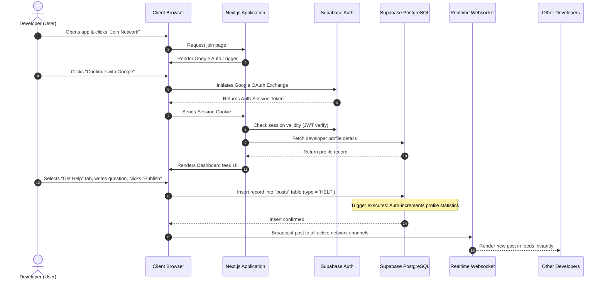
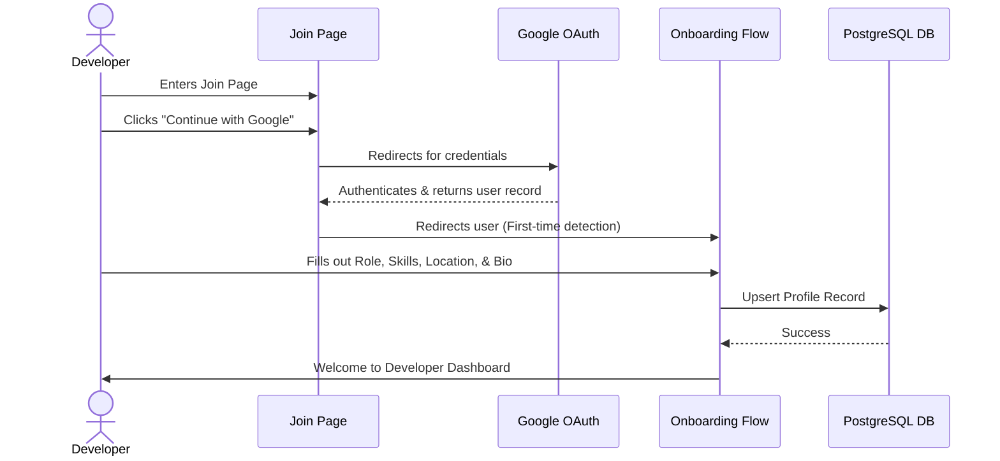
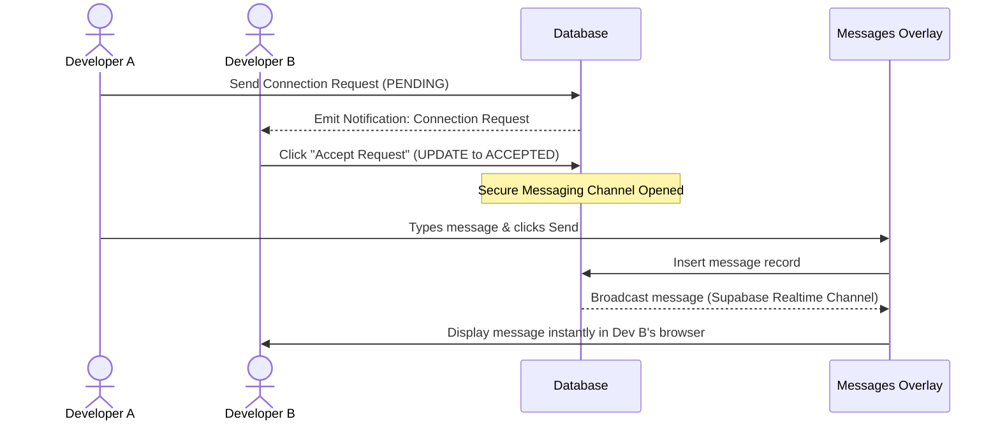
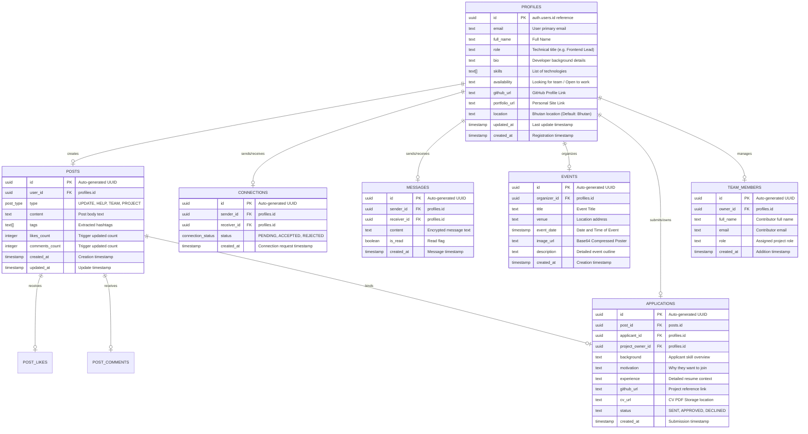

# Bhutan Developer Network (DevelopersConnect)
## Comprehensive Project Documentation
*Prepared by Antigravity — Senior Solutions Architect & Technical Writer*

---

## 1. Executive Summary

### What This Project Does
The **Bhutan Developer Network (BDN)** (internally referred to as **DevelopersConnect**) is a dedicated digital directory and collaboration space tailored specifically for technology professionals, engineers, and student builders in Bhutan. It functions as a structured "working network" designed to make technical talent visible, facilitate mutual assistance, and streamline the assembly of project teams.

### Who Uses It
- **Software Developers & Engineers:** Professional backend, frontend, and full-stack builders who want to showcase their skills and collaborate.
- **Computer Engineering & Science Students:** Aspiring developers looking for mentorship, guidance, and peer-to-peer collaboration opportunities.
- **Freelancers & Tech Entrepreneurs:** Independent professionals seeking to connect with local clients or find co-founders.
- **Platform Administrators:** Managers who verify members and moderate community events.

### What Business Problem It Solves
Historically, Bhutan's tech ecosystem has suffered from extreme fragmentation:
1. **Information Silos:** Community interactions, technical troubleshooting, and project collaboration occur in unorganized, informal chat groups (such as Telegram or WhatsApp), leaving no searchable record or permanent knowledge base.
2. **Trust Deficit:** Recruiters and team organizers lack a verified, central directory to check local developers' availability, active work status, and true technical credentials, resulting in inefficient team formation and hiring mismatch.
3. **Professional Isolation:** Student builders and freelancers operate in silos, missing opportunities to collaborate on large-scale national products.

### Why It Exists
BDN exists to establish a secure, trusted, and localized coordination layer for Bhutanese developers. By consolidating professional identity, real-time help, and team-building under a single interface, it accelerates skill acquisition, increases the visibility of local talent, and helps bring national projects to life.

---

## 2. Business Overview

The Bhutan Developer Network adds value to the tech community by establishing a unified developer lifecycle. Below is the breakdown of user roles and the core business workflow that translates platform activity into real-world outcomes.

```
[ Developer Sign-Up & Google Auth ] 
               │
               ▼
[ Profile Creation (Skills, Bio, Location) ]
               │
      ┌────────┴────────┐
      ▼                 ▼
[ Help Feed Query ]   [ Team Assembly ] ──► [ Direct DM Sync ] ──► [ Project Collaboration ]
```

### User Roles
| Role | Responsibility | Platform Value |
| :--- | :--- | :--- |
| **Developer / Builder** | Creates profiles, posts technical updates, asks for assistance, and answers questions. | Gains peer recognition, receives immediate project help, and finds work opportunities. |
| **Team Lead / Project Owner** | Outlines team needs, recruits builders, and manages team lists. | Assembles verified teams quickly without sorting through spam applications. |
| **Ecosystem Admin** | Oversees community events, coordinates manual verifications, and maintains platform moderation. | Ensures the network remains trusted, professional, and Bhutan-focused. |

### Business Workflows & Value Delivered
- **The Help Loop:** A developer hits a blocker (e.g., database synchronization issues), posts a query with their specific tech stack, and receives direct answers from senior peers. This minimizes development downtime and functions as a community-driven helpdesk.
- **The Team Formation Flow:** A project organizer lists open positions (e.g., looking for a React developer for a Bhutanese tourism app). Interested candidates review the requirements, check the project owner's credentials, and apply. This bridges the gap between project ideas and successful execution.
- **Direct Technical Sync (Messaging):** Verified connections can initiate private, direct chat synchronization to discuss codebase specifics, schedule meetings, or coordinate technical integrations.

---

## 3. High-Level Architecture

The Bhutan Developer Network uses a modern, lightweight Web 2.5 hybrid system designed for high performance, real-time synchronization, and low operational costs.



### Component Interaction & Data Flow
1. **Frontend (Next.js & Vercel):** Serves responsive, interactive pages. Executes client-side logic for direct database calls and local caching.
2. **Authentication (Supabase Auth & Google OAuth):** When a user logs in, they are redirected to Google. Once authenticated, Google passes verification back to Supabase, which issues a secure digital pass (JWT) stored in the browser's cookies.
3. **Database (PostgreSQL & RLS):** Supabase handles database transactions. Every query is intercepted by Row-Level Security (RLS) rules that check the user's digital pass to verify if they have the authority to read or edit that record.
4. **Real-time Engine (Supabase WebSockets):** Powers the Direct Chat overlay. As soon as User A inserts a message into the database, Supabase broadcasts it directly to User B's active browser window.
5. **Team Application Pipeline:** When a developer clicks "Apply to Team," the request goes to Next.js API route `/api/send-application`. The API validates the inputs, escapes malicious inputs, checks if the target owner exists, and triggers an email notification via the Resend API.

---

## 4. Project Structure

The codebase is organized into modular directories using Next.js App Router conventions and feature-based scoping:

```
developersconnect/
├── app/                  # NEXT.JS ROUTING & PAGES LAYER
│   ├── (marketing)/      # Landing page, about, terms, events, and static views
│   ├── api/              # Backend API endpoints (e.g., send-application email pipeline)
│   ├── auth/             # Authentication callback endpoints and error handlers
│   ├── dashboard/        # The core workspace feed, search filters, and interaction tabs
│   ├── identity/         # Settings page for user profiles and team member management
│   ├── join/             # Registration gateway with Google Authentication buttons
│   ├── messages/         # Desktop synchronized chat workspace
│   ├── onboarding/       # Setup flow for new accounts to select roles and enter bios
│   └── profile/          # Public developer directory details
├── components/           # REUSABLE UI PRIMITIVES
│   ├── common/           # Shared components (Global header, footer, analytics wrapper)
│   └── ui/               # Standard UI design system (buttons, inputs, cards, dialogs)
├── features/             # LOGICAL DOMAIN-DRIVEN COMPONENTS
│   ├── dashboard/        # Dashboard layout, post feeds, message overlay, and status hooks
│   ├── identity/         # Settings forms, tab switches, and team editor lists
│   └── marketing/        # Landing page sections, FAQs, and founder bios
├── lib/                  # CORE CLIENT UTILITIES & SERVICES
│   ├── services/         # Business services abstraction (posts, profiles, team operations)
│   ├── supabase/         # Client and Server SDK instance initializations
│   ├── analytics.ts      # Google Analytics 4 engagement triggers
│   └── utils.ts          # Styling helper utilities (tailwind merge adjustments)
├── database/             # DATABASE ASSETS & SCHEMAS
│   ├── triggers/         # Automated triggers (auto-incrementing likes/comments)
│   └── maindatabaserightnow.sql  # Reference schema, constraints, and initial views
├── providers/            # REACT CONTEXT PROVIDERS
│   └── profile-provider.tsx # Manages global state of user auth session and user profiles
└── public/               # STATIC ASSETS
```

---

## 5. Application Flow

The diagram below details the end-to-end flow when a developer signs into the platform and publishes a technical request on the Help Feed.



---

## 6. Feature Documentation

### 6.1. Developer Profiles (Identity Layer)
- **Purpose:** To provide a verifiable, public-facing technical resume for developers in Bhutan.
- **Business Value:** Replaces unverified paper resumes with a centralized profile showing the developer's location, active availability status, tech stack, and verified portfolio links.
- **Who Uses It:** All developers (to represent themselves) and team leads (to scout collaborators).
- **Workflow:** 
  1. User registers and completes onboarding.
  2. Enters location, bio, GitHub link, availability, and specific skills.
  3. Saves changes, which immediately updates the public directory.
- **Business Rules:** 
  - Availability status must belong to pre-defined options: `Looking for team`, `Open to work`, or `Just exploring`.
  - Bios are capped at a maximum character threshold to keep descriptions readable.
- **Related APIs:** `ProfilesService.update()`, `ProfilesService.getById()`.
- **Related Tables:** `public.profiles` (linked to `auth.users`).
- **Example Scenario:** Pema, a frontend student in Thimphu, updates her profile to "Open to work" and selects `React` and `TypeScript` as skills. A tech startup co-founder instantly finds her in the directory and reviews her work.

### 6.2. Help Feed (Engagement Engine)
- **Purpose:** To provide an immediate technical helpline for developers facing coding blockers.
- **Business Value:** Accelerates issue resolution within Bhutanese development teams by leveraging collective national expertise.
- **Who Uses It:** Developers of all tiers (junior developers post blockers; seniors offer solutions).
- **Workflow:**
  1. Developer selects "Get Help" on their dashboard.
  2. Fills in the specific blocker details, stack used, and context.
  3. Clicks "Publish" to display the post in the community feed.
- **Business Rules:**
  - Content must include a description of the blocker; blank posts are rejected.
  - Tags are parsed automatically from hashtags (`#React`) and comma-separated stack fields.
- **Related APIs:** `PostsService.create()`, `PostsService.getByType()`.
- **Related Tables:** `public.posts` (records of type `HELP`), `public.post_comments`.
- **Example Scenario:** Tashi is blocked by a database authentication error. He posts a help request labeled `#supabase`. Within an hour, another developer comments with the correct configuration pattern.

### 6.3. Team Formation & Applications
- **Purpose:** To enable developers to pitch projects, request specific technical assistance, and gather team members.
- **Business Value:** Lowers the friction of launching local startups or hackathon teams.
- **Who Uses It:** Project creators (to advertise roles) and applicants (to apply to teams).
- **Workflow:**
  1. Creator posts a "Team Search" entry outlining the roles, project concept, and mission.
  2. Interested developer clicks "Apply" on the card.
  3. Developer fills in their experience, motivation, and uploads their CV.
  4. Application triggers `/api/send-application` API, emailing the project owner.
- **Business Rules:**
  - The recipient email must belong to a registered developer profile to prevent spam relays.
  - Application submissions require mandatory fields (applicant name, role, motivation, resume URL).
- **Related APIs:** `/api/send-application` (POST).
- **Related Tables:** `public.posts` (type `TEAM`), `public.applications`.
- **Example Scenario:** Sonam wants to build a local ride-sharing dashboard. He posts a team search. Ugyen clicks "Apply," providing his GitHub details. Sonam receives an email containing Ugyen's details and a link to view his CV.

### 6.4. Direct Chat Synchronization
- **Purpose:** To allow developers to sync privately and discuss collaboration details.
- **Business Value:** Provides a secure workspace messaging channel that separates professional project coordination from social media.
- **Who Uses It:** Users who have sent or accepted connection requests.
- **Workflow:**
  1. User A visits User B's profile and clicks "Connect."
  2. User B accepts the request in their dashboard notification panel.
  3. An active channel is established, enabling real-time messaging in the `MessagesOverlay`.
- **Business Rules:**
  - Messaging is restricted to accepted connections; users cannot message random developers.
  - Messages are updated in real-time using Supabase WebSocket subscriptions.
- **Related APIs:** Supabase Realtime Channels, `connections` updates.
- **Related Tables:** `public.connections`, `public.messages`.
- **Example Scenario:** Once Ugyen's team application is reviewed, Sonam accepts Ugyen's connection request. They open the overlay and discuss the database architecture via direct messages.

### 6.5. Community Event Host Grid
- **Purpose:** To list and organize local tech events, workshops, and hackathons.
- **Business Value:** Fosters community cohesion, offline networking, and continuous technical training.
- **Who Uses It:** Organizer (to broadcast meetups) and developers (to discover upcoming events).
- **Workflow:**
  1. Authorized user clicks "Host Event" tab.
  2. Inputs title, venue, date, end date, and description.
  3. Uploads event poster (compressed to base64 format client-side).
  4. Publishes, adding the event to the community grid.
- **Business Rules:**
  - Host must be an authenticated user.
  - Mandatory fields include title, venue, and date.
- **Related APIs:** Database inserts via Supabase SDK.
- **Related Tables:** `public.events`.
- **Example Scenario:** The Bhutan Innovation Hub hosts a "Next.js 16 Boot Camp." They publish it to the Event Grid. Developers see it on their dashboard and make plans to attend.

---

## 7. User Journeys

### 7.1. Onboarding & Registration Journey
A new developer enters the portal, creates an account, and sets up their professional presence.



### 7.2. Connecting & Messaging Journey
Two developers establish a connection and communicate securely via direct message.



---

## 8. API Documentation

Because DevelopersConnect relies on Supabase as a Backend-as-a-Service (BaaS), most write and read operations bypass traditional API endpoints and instead query the database directly using the Supabase Client SDK. However, custom backend logic (such as sending emails) is handled via Next.js API Routes.

### 8.1. Team Application Synchronization Endpoint
- **Purpose:** Submits a developer's application for an open project and sends an email notification to the project owner.
- **Method:** `POST`
- **URL:** `/api/send-application`
- **Authentication Required:** Yes (via client session validation verify)
- **Request Headers:**
  - `Content-Type: application/json`

**Request Body Structure:**
```json
{
  "ownerEmail": "project-owner@developersconnect.xyz",
  "applicantName": "Jigme Tobgay",
  "role": "Full Stack Engineer",
  "project": "Bhutan Tourism Portal",
  "motivation": "I have 3 years of experience in React and Node.js and would love to help optimize the site.",
  "cvUrl": "https://supabase-storage.url/cv/jigme_resume.pdf"
}
```

**Successful Response (200 OK):**
```json
{
  "success": true,
  "id": "e45db096-7c38-42f8-95df-4d693f4125b2"
}
```

**Common Error Responses:**
- `400 Bad Request`: Missing mandatory fields.
  ```json
  { "error": "Missing mandatory fields" }
  ```
- `403 Forbidden`: Recipient email does not belong to a registered developer profile.
  ```json
  { "error": "Unauthorized recipient: Target email must belong to a registered developer." }
  ```
- `500 Internal Server Error`: Email delivery service (Resend) misconfigured.
  ```json
  { "error": "Email service misconfigured" }
  ```

- **Business Rationale:** This endpoint acts as a spam barrier. It verifies that the destination email matches a verified developer in the database before routing. This prevents the server from being used to send spam.

---

## 9. Database Documentation

The platform uses a relational PostgreSQL database hosted on Supabase. Row-Level Security (RLS) is enabled across all tables to enforce strict data isolation policies.

### 9.1. Database Entity-Relationship Diagram (ERD)



### 9.2. Database Tables & Descriptions

#### Table: `public.profiles`
- **Purpose:** Stores extended user details. Linked to the master auth table.
- **Key Fields:**
  - `id` (UUID, Primary Key): Links directly to `auth.users` to maintain login connection.
  - `skills` (TEXT[]): List of developer skills, used to match developers for teams.
  - `availability` (TEXT): Represents availability. Useful for active search queries.

#### Table: `public.posts`
- **Purpose:** Central feed repository supporting Updates, Help queries, Team requests, and Projects.
- **Key Fields:**
  - `type` (post_type Enum): Restricts posts to four key business types.
  - `likes_count` & `comments_count` (INTEGER): Automatically managed by SQL triggers to reduce UI reading load.

#### Table: `public.connections`
- **Purpose:** Maps connection requests between network members.
- **Business Rule Constraints:** Unique constraint on `(sender_id, receiver_id)` prevents duplicate requests. A check constraint prevents users from connecting with themselves.

#### Table: `public.messages`
- **Purpose:** Direct chat transcripts.
- **Row-Level Security (RLS) Policy:** Accessible only by participants whose user ID matches the sender or receiver field.

---

## 10. Authentication & Authorization

### How Users Log In
Users register and log in via **Supabase Auth** utilizing **Google Sign-In (OAuth)**.
1. The user clicks "Continue with Google" on the Join page.
2. The request is redirected to Google's sign-in page to authenticate their identity.
3. Once authenticated, Google redirects back to the portal callback endpoint (`/auth/callback`), carrying a secure verification token.
4. The callback handler verifies this token with Supabase and sets up a user session.

### How Sessions Work
The browser receives a **JSON Web Token (JWT)**, which acts as a secure digital pass. Every subsequent call to Supabase passes this pass in the header. The system reads this token to verify the user's identity. Session status is managed globally across React components by the `ProfileProvider` wrapper.

### Authorization & Permissions (RLS Policies)
Instead of relying on custom middleware, data permissions are enforced directly by the database using **Row-Level Security (RLS)**:
- **Profiles:** Anyone can view a public profile. However, updates (`UPDATE`) are blocked unless the logged-in user's ID matches the profile ID: `auth.uid() = id`.
- **Posts:** Anyone can view the feed. Only authenticated users can write new posts. Users can only delete posts they created: `auth.uid() = user_id`.
- **Messages:** Message transcripts are restricted. They are only queryable if the logged-in user is either the sender or the receiver: `auth.uid() = sender_id OR auth.uid() = receiver_id`.

---

## 11. Integrations

The system uses three external integrations:

1. **Google Identity (OAuth):**
   - *Why it exists:* Provides a quick registration flow. Users do not need to create and remember a new password, reducing sign-up friction.
   - *Failure Impact:* If Google Auth is down, users cannot log in or register.

2. **Resend Email API:**
   - *Why it exists:* Integrates with `/api/send-application` to email project owners when someone applies to their team.
   - *Failure Impact:* If Resend fails, application records are saved in the database, but owners will not receive email notifications.

3. **Google Analytics 4 (GA4):**
   - *Why it exists:* Tracks user behavior (e.g., clicks, login patterns, event creation) in production.
   - *Failure Impact:* Anonymized tracking fails, but core app services continue to function.

---

## 12. Configuration

All configuration is managed through environment variables in the `.env.local` file. Changing these variables changes how the application behaves and integrates with external services.

### Environment Variable Guide

| Variable Name | Required | Target Environment | Business Meaning & Impact |
| :--- | :--- | :--- | :--- |
| `NEXT_PUBLIC_SUPABASE_URL` | Yes | Local & Production | The endpoint of the database. Changing this redirects the app to a different database. |
| `NEXT_PUBLIC_SUPABASE_ANON_KEY` | Yes | Local & Production | The public API key used by the browser to read data. |
| `RESEND_API_KEY` | Yes | Production (Server Only) | Key for the email relay API. If missing or invalid, email notifications for team applications will fail. |
| `NEXT_PUBLIC_GA_MEASUREMENT_ID` | No | Production | Google Analytics ID. If left blank, tracking is disabled. |

---

## 13. Deployment

The application is deployed using a standard Next.js and Supabase architecture.

```
                  [ Vercel Edge Server ]
                   ├── Host Next.js Static Pages
                   └── Executes Serverless API (/api/send-application)
                             │
                             ▼
                  [ Supabase BaaS Cloud ]
                   ├── User Authentication & Sessions
                   ├── PostgreSQL Database Schema
                   └── WebSocket Real-time Messaging
```

### Hosting Strategy
- **Frontend & API Routes (Vercel):** The React frontend is deployed to Vercel. Static pages are cached at the edge close to Bhutan users, while API routes run as serverless functions.
- **Backend & Database (Supabase Cloud):** The PostgreSQL database, RLS engines, and Web3 profiles are hosted on Supabase Cloud.

### Deployment Prerequisites
1. Set up a Supabase project and execute the SQL file `maindatabaserightnow.sql` inside the Supabase SQL editor to create the necessary tables, triggers, and views.
2. Configure Google Cloud Console to enable Google OAuth, adding the redirect URI `https://YOUR_SUBDOMAIN.supabase.co/auth/v1/callback`.
3. Set environment variables on the Vercel project settings dashboard.
4. Deploy the main branch.

---

## 14. Error Handling

- **Form Validation:** Input validation is handled client-side using native HTML forms and Zod schemas, preventing invalid submissions.
- **API Errors:** The `/api/send-application` route uses `try/catch` blocks. If an error occurs, it returns an appropriate JSON error response and HTTP status code (e.g., `400` or `403`) instead of crashing.
- **User Notifications:** User feedback is handled via the `Sonner` toast notification manager. If a network action fails, a notification pops up detailing the error.
- **Database Safety:** DB triggers handle database statistics (like likes/comments count). This prevents database crashes if calculations fail.

---

## 15. Security

DevelopersConnect uses several security measures:
1. **Row-Level Security (RLS):** This database constraint prevents users from tampering with data they do not own.
2. **Cross-Site Scripting (XSS) Prevention:** Text input inside the `/api/send-application` endpoint is escaped before being emailed.
3. **Google OAuth Verification:** Since passwords are not handled locally, the platform is protected from database credential theft.
4. **Token Security:** Private API keys (like the Resend API Key) are stored server-side and never exposed to the client browser.

---

## 16. Business Rules

The following business rules are enforced by the codebase:

1. **Self-Connection Block:** A developer cannot send a connection request to themselves. This is enforced by database rules.
2. **Email Destination Lock:** Team applications can only be sent to email addresses belonging to registered users on the platform. This prevents the server from being used as a spam relay.
3. **Real-time Messaging Lock:** Developers can only chat if they have a connection request marked as `ACCEPTED`.
4. **Auto-updating Metrics:** When a post is liked or commented on, the count updates automatically via database triggers.
5. **Bhutan-First Default:** New developer profiles default to Bhutan as their location.

---

## 17. Glossary

- **API (Application Programming Interface):** A set of rules that allows different software applications to communicate with each other.
- **BaaS (Backend-as-a-Service):** A cloud service model where developers outsource the behind-the-scenes aspects of web development (like database management and authentication).
- **JWT (JSON Web Token):** A secure, digital pass issued to a logged-in user that proves their identity to the server.
- **OAuth:** An open standard authorization protocol that allows applications to access user details from services like Google without exposing passwords.
- **PostgreSQL:** An open-source relational database management system used to store platform data.
- **RLS (Row-Level Security):** A database feature that controls access to table rows based on the user executing the query.
- **Real-time WebSocket:** A communication protocol that allows the server to send data to the client instantly without the client needing to request it.

---

## 18. Frequently Asked Questions

### For Business Users & Project Managers
- **Is user data safe?** Yes, all profile and communication data is secured using Supabase user authentication and Row-Level Security policies.
- **How do team applications reach project owners?** When a user applies, an email is sent to the project owner's verified address using the Resend API.

### For QA & Support Teams
- **Why is the chat input disabled on `/messages`?** Direct messages are managed via the sliding chat overlay on the main dashboard. The `/messages` view displays a setup screen if no chat is active.
- **Why can't I change my password in Settings?** Since authentication is handled via Google OAuth, local password updates are disabled.

### For Developers
- **How is image upload managed?** Event posters and updates are compressed and converted to Base64 data URLs client-side, avoiding the need for a Supabase Storage bucket configuration.
- **Where do I add new database tables?** Add them to `database/maindatabaserightnow.sql` and run them in the Supabase SQL editor.

---

## 19. Known Limitations

*Based on the codebase, the following limitations are present in the current build:*

1. **Proposed Blockchain Badge Concept:** The Polygon blockchain badges described in `official_project_doc.md` are not implemented. The codebase contains no Solidity smart contracts or Web3 wallet connection integrations.
2. **Pending Feed Enhancements:** Inline comments on feed posts, custom developer reactions, and live bell notifications are on the roadmap but not yet implemented.
3. **Local Storage of Images:** Because Supabase Storage buckets are not configured by default, images are compressed and saved directly in the PostgreSQL database as Base64 strings. Large images may cause database latency.
4. **Mocked Settings Forms:** The password change form in Settings is a placeholder and does not update user credentials.

---

## 20. Suggestions

1. **Move Images to Storage Buckets:** Instead of saving Base64 images directly in the database, configure Supabase Storage buckets for avatars and event posters. This will reduce database size and improve page load speeds.
2. **Implement Real-time Presence:** Use Supabase Presence to show which developers are online, making the platform feel more active.
3. **Add Rich Message Support:** Update the chat window to support Markdown rendering, allowing developers to share code snippets easily.
4. **Implement Blockchain Integration:** To fulfill the design proposed in `official_project_doc.md`, integrate Web3 libraries (like Ethers.js or Wagmi) and develop Solidity smart contracts to mint verifiable Skill Badges.
